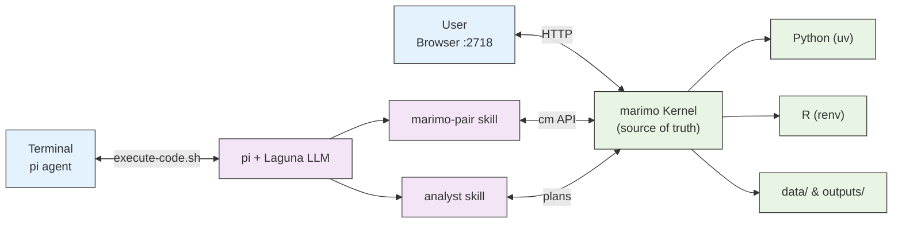

# Petri Setup (Simplified)

```
          ┌─────────────────────────────────────────────┐
          │              USER                           │
          │  Browser :2718     Terminal (pi)            │
          └──────┬──────────────┬───────────────────────┘
                 │              │
                 │ HTTP         │ bash execute-code.sh
                 │      ┌───────▼───────┐
                 │      │     pi        │  ◄── LLM: Laguna-S-2.1
                 │      │ (coding       │      (local-llama)
                 │      │  agent)       │
                 │      └───┬───────┬───┘
                 │          │       │
                 │  Skills  │       │
                 │  ┌───────┴──┐    │
                 │  │marimo-   │    │
                 │  │pair      │    │
                 │  │(cm API)  │    │
                 │  └─────┬────┘    │
                 │        │         │
                 │  ┌─────▼────┐    │
                 │  │ analyst  │    │
                 │  │(analysis │    │
                 │  │  rules)  │    │
                 │  └─────┬────┘    │
                 │        │         │
                 └────────┼─────────┘
                          │ Kernel RPC
                ┌─────────▼─────────┐
                │  marimo Kernel    │  ◄── source of truth
                │  (reactive DAG)   │
                └─────────┬─────────┘
                          │
         ┌────────────────┼────────────────┐
         │                │                │
     ┌───▼───┐        ┌───▼───┐      ┌─────▼─────┐
     │Python │        │   R   │      │  Files    │
     │  (uv) │        │(renv) │      │           │
     │       │        │       │      │data/      │
     │numpy, │        │ggplot2│      │outputs/   │
     │polars,│        │limma  │      │           │
     │scipy  │        │       │      │           │
     └───────┘        └───────┘      └───────────┘
```



### Flow

1. **User** views the notebook in the browser at `localhost:2718` and runs **pi** in the terminal
2. **pi** (powered by **Laguna** LLM) loads two skills: **marimo-pair** (for kernel control) and **analyst** (for analysis methodology)
3. **marimo-pair** bridges pi to the **marimo kernel** via bash scripts and the `cm` API
4. The **kernel** is the source of truth — it runs all Python/R code and writes results to `data/` and `outputs/`
