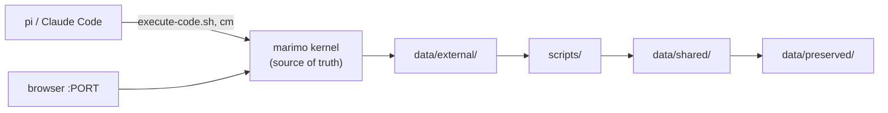

# Architecture & Design Decisions

This document describes the design decisions behind the `petri` project template.

---

## 1. marimo Reactive Notebook Model

Unlike traditional Jupyter notebooks (`.ipynb` JSON files with out-of-order execution), marimo notebooks are **reactive, deterministic Python programs** saved as `.py` files.

- **DAG Dataflow**: marimo parses cell inputs/outputs and constructs a Directed Acyclic Graph (DAG). When a variable changes (e.g. via a slider or parent cell), marimo automatically re-executes dependent cells in topological order.
- **Single Definition Rule**: A public name can only be defined in one cell across the entire notebook. Use private variables (`_name`) for cell-internal temporaries.
- **Git-friendly**: Notebooks are valid Python scripts that diff, review, and format like standard code.

---

## 2. Python <-> R Interop (`petri/r_bridge.py`)

Embedding R inside Python using `rpy2` within a reactive, multi-threaded notebook runtime presents several edge cases. `petri/r_bridge.py` solves them centrally:

1. **Working Directory & `renv` Auto-activation**:
   - `marimo` sets the Python kernel's working directory to `notebooks/`.
   - `petri/r_bridge.py` changes `os.chdir(PROJECT_ROOT)` before `import rpy2.robjects as ro`.
   - When R initializes, it uses `getwd()` (`PROJECT_ROOT`), automatically finding `.Rprofile` and running `.renv/activate.R` once.

2. **CFFI ABI Mode**:
   - `petri/r_bridge.py` sets `os.environ["RPY2_CFFI_MODE"] = "ABI"` before importing `rpy2` to silence stderr CFFI warnings when the installed `rpy2` wheel was compiled against a different R build.

3. **Thread-Safe Conversion Rules (`ContextVar`)**:
   - `rpy2` stores type conversion rules in a Python `contextvars.ContextVar`.
   - Because marimo runs cells in separate execution contexts, calling `rpy2` without context wrapping causes `NotImplementedError: Conversion rules ... appear to be missing`.
   - `petri/r_bridge.py` wraps all R operations (`r_eval`, `r_set`, `pl_to_r`, `py_to_r`, `r_to_pl`, `r_to_np`, `r_to_py`, `r_png`) inside `with _conv.context():`, keeping notebook cell code clean and error-free.
   - This is why graphics capture belongs in the bridge too. `rpy2.robjects.lib.grdevices` calls `importr("grDevices")` at *import* time, so a cell that imports it directly raises the missing-rules error before drawing anything. `r_png()` performs that import inside the context, which is also why its import sits in the function body rather than at module scope.

4. **Polars Data Transfers**:
   - Transfers data to/from R directly using `ro.DataFrame`, `ro.StrVector`, and `ro.FloatVector` without a `pandas` dependency or `pandas2ri` overhead.
   - The R→Python conversion is honest to the R object type: data.frames go
     through `r_to_pl` → Polars, matrices/vectors through `r_to_np` → NumPy,
     and lists through `r_to_py` → native Python (`dict` for named lists,
     `list` otherwise). The Python→R inverse is `py_to_r` (native dict/list →
     R list). Matrices/data.frames passed to `r_to_py` raise with a hint, so
     each call's return type stays predictable.

---

## 3. R Package Management (`renv`)

- **Venv-like Isolation**: R packages install into `.renv/library/` (gitignored), mirroring `.venv/`. `renv.lock` sits at the root beside `uv.lock` and tracks exact versions.
- **Custom Snapshot Filter**: Because R code lives inside Python strings in notebook files, standard `renv` dependency scanning ("implicit" mode) cannot discover imports. `.renv/settings.json` sets `snapshot.type = "custom"`, and `.Rprofile` defines a filter that snapshots whatever packages are present in `.renv/library/`.

---

## 4. AI Agent Pairing (`marimo-pair` skill)

- **Kernel as Source of Truth**: The active marimo kernel namespace holds the live session state. File edits on disk during a session are ignored or overwritten by marimo.
- **Scratchpad Execution**: `execute-code.sh` evaluates Python code in marimo's scratchpad namespace.
- **Code Mode (`cm`)**: To make persistent changes (create, edit, re-run, or delete cells), agents use `marimo._code_mode` inside the scratchpad.

The runtime has four levels: **server → session → kernel → scratchpad**. The
last two decide what an agent's work leaves behind. The scratchpad shares the
kernel namespace, but it is outside the notebook file and outside the dependency
graph.

Definitions, source citations, and the frozen-snapshot rules are in
[`petri/skills/marimo-pair/reference/execution-context.md`](../skills/marimo-pair/reference/execution-context.md),
with the skill that uses them.

---

## 5. Artifacts & Data Layers (`petri/provenance.py`)

A marimo notebook is already reproducible: the `.py` file is the program, and git
versions it. That covers the code, not what the notebook writes. `petri/provenance.py` adds identity, provenance, and integrity for the
output.

### Two kinds of artifact

An artifact is any file petri writes with a manifest. There are two kinds,
separated by who reads them.

| Kind | Location | Read by | On mismatch |
|---|---|---|---|
| shared | `data/shared/` | other notebooks | `load_shared()` raises |
| preserved | `data/preserved/<notebook>/<name>/` | people | `make check` reports |

A shared table has downstream consumers. If it is edited by hand or is out of
date, it must fail at read time, before it reaches a figure. A preserved
artifact has no consumers, so its check only reports whether it still matches
the code and inputs recorded for it.

No notebook reads another notebook's preserved artifact. A result that other code
needs is an interface, not a deliverable, and goes to `data/shared/` through
`save_shared()`. See *Not in scope* below for the rest of what this rules out.

### Naming

Each data directory is named for the function that writes it:
`load_external()` → `data/external/`, `save_shared()` → `data/shared/`,
`preserve_*()` → `data/preserved/`. "Artifact" covers both kinds, so no directory uses that name.

### Boundary

A notebook reads `data/shared/`. A producer notebook also reads `data/external/`.
Petri versions `data/shared/`, so every notebook input is verifiable.

`data/external/` is outside the boundary. Petri does not own those files and does not
preserve them. It records `(path, size, sha256)` and reports a change as a
warning, because the file can be re-supplied from outside without petri.

Petri therefore guarantees reproducibility from `data/shared/` onward. External
inputs are recorded, not guaranteed.

### Identity

A preserved bundle is addressed by `<notebook stem>/<name>`. The runtime context
supplies the notebook. The name is an argument, because the marimo kernel does
not expose a cell's own name at runtime. It exposes the notebook path and an
ephemeral cell id such as `pmun`. Cell names live in the session document.

A rename therefore leaves the bundle under the old name. `check()` reads the
notebook with marimo's `load_app()` and confirms that a cell of that name exists
and that its code hash matches the manifest. Renaming, deleting, or editing a
producing cell is a `check` error.

Cell code is hashed after whitespace at the edges is removed. The kernel reports
`cell.code` with a trailing newline; the on-disk form has none. Hashing the raw
text marks every artifact stale as soon as it is written.

`check()` also walks the other direction, from the files to the manifests. An
artifact is a file plus a manifest, so a file that no manifest records — a table
copied in by hand, a figure left by an interrupted run — is an error. Verifying
manifests alone let such a tree report clean.

### Publishing a shared table

A cell that calls `save_shared()` is the producing side of the interface layer. It
reads `data/external/`, calls a pure function in `scripts/`, and publishes. The
notebook that publishes a table may also read it back, or a later notebook may.

Writing a file is not a dependency marimo can see. `load_shared()` opens a path;
nothing in the graph connects it to the cell that wrote that path, so marimo is
free to run the reader first. `save_shared()` returns the file it wrote for this
reason: return that path, take it as an argument in the reading cell, and the edge
exists. Ordering by hand — a numeric filename prefix, a runner that sorts — is the
alternative, and it duplicates a graph the kernel already has.

There is no DAG engine across notebooks, and no target that rebuilds them. A
notebook is rebuilt by running it, in the editor or headless through the
`app.run()` call at its end. `make` exports `PYTHONPATH` for the headless case:
`python notebooks/x.py` puts `notebooks/` on `sys.path`, not the repo root, and
marimo's `runtime.pythonpath` applies only to the editor. Transformations are
already plain functions in `scripts/`, so a move to Snakemake would not require
rewriting them.

Two runtime settings support the same notebooks in the editor.
`auto_instantiate = false` prevents a pipeline run when you open a notebook.
`auto_reload = "lazy"` marks importing cells stale when you edit a module in
`scripts/`, instead of keeping the kernel on the previous version.

### Code dependencies

Transformations live in `scripts/`, not in cells. Functions there are
testable without a kernel, and a thin cell does not re-run an expensive chain
when you edit the transformation. (`on_cell_change` is `autorun`.)

The cell hash cannot see those functions. Rewrite one, re-run, and no recorded
value changes. Each manifest therefore also carries `code_deps`: the hash of
every project-local module the cell imports, resolved through `sys.modules` at
write time. Editing a module in `scripts/` marks the artifacts that import it
stale and leaves the rest unchanged.

`code_deps` covers modules under `PROJECT_ROOT`, except `petri/`, `.venv/`, and
site-packages. Hashing the template would mark every artifact stale on a
template update. Dependency versions belong in `tool` and the lockfiles.

Resolution takes both readings of `from pkg import name`, since the name may be
a submodule rather than an attribute, and it hashes each ancestor package as
well, because a package `__init__` runs when a submodule is imported. What it
does not cover is a module imported by another module: `code_deps` records what
the cell imports, not the whole transitive closure.

### Manifests

Each artifact has one JSON manifest: `data/shared/<name>.manifest.json`, or
`manifest.json` inside a preserved bundle. `manifest_version` is checked on
read; a manifest from a newer petri is an error, not a silent misread.

Git ignores all of `data/`, manifests included. Provenance is verified where the
data is, by `make check`, rather than shipped through the repository — a manifest
is a generated file, and the person using the template decides what of their own
work to version. Committing one is a deliberate act (`git add -f`), worth doing
when a collaborator has to verify a table they cannot download.

#### The v1 schema

This is what `manifest_version: 1` promises. Keys are sorted and the file ends with
a newline, so a manifest diffs cleanly. In the table, **derived** means the value
comes from the artifact itself, and **read by** names the code that uses it.

| Field | Kind | Derived | Read by |
|---|---|---|---|
| `manifest_version` | both | — | `_load_manifest`, which refuses a higher one |
| `kind` | both | — | nothing yet; it labels the layer |
| `id` | both | yes | `check()` — for preserved, it must equal a cell name |
| `title` | both | — | `list_shared()`, `list_preserved()` |
| `notebook` | both | yes | `check()`, to find the cell and hash its code |
| `cell_code_sha256` | both | yes | `check()` identity pass |
| `created` | both | first-seen, carried forward | `list_*` only |
| `code_deps` | both | yes | `check()` — a changed module is an **error** |
| `inputs` | both | yes | `check()` — see the severity rule below |
| `outputs` | both | yes | `check()`, `load_shared()` |
| `rows` | shared | yes | `list_shared()` |
| `schema` | shared | yes | `load_shared()`, to rebuild dtypes from CSV |

A preserved manifest has no `schema` and no `rows`. `schema` exists so
`load_shared()` can restore dtypes that CSV cannot carry, and nothing loads a
preserved artifact, so a schema there would never be read.

**`schema` holds Polars dtype reprs, and only the class name matters.** A value is
`str(dtype)`, so it can read `Datetime(time_unit='us', time_zone=None)`. The reader
takes the text before the first `(` and looks that name up on the `polars` module,
which returns the bare class with its default settings. Anything inside the
parentheses is lost. This is why `save_shared()` rejects a parameterised dtype
instead of recording it: the manifest can describe it, but the read cannot rebuild
it.

This is the one field whose format depends on another library's `__repr__`, which
is not a documented interface. The choice is deliberate: Polars has no schema
serialisation that fits a manifest people read with `grep`, and `to_arrow()` does
not. Two things make it safe enough. Reading only the class name means a repr whose
parameters change still resolves, and Polars keeps old dtype names as aliases, so a
`Utf8` recorded years ago still finds `String`. A name that resolves to nothing is
skipped, and that column falls back to type inference instead of failing.

`rows` is the only field verification does not use. Nothing checks it, and it
cannot be wrong, because a hand-edited table fails its hash first. It is there for
`list_shared()`. Do not add more fields like it: column counts, byte sizes and
minima describe the data, not how it was made, and belong to whoever reads it.

Two rules govern this table. Both were broken once.

**No field changes on its own.** Everything except `title` and `created` is
derived, and `created` is copied from the previous manifest rather than written
again. Three fields broke this rule and are gone. An mtime came first, as a
shortcut that let verification skip the hash; a rebuilt table is byte-identical
but newly stamped, so a rebuild rewrote every manifest it touched while changing
nothing. A `git_commit` of HEAD and a `tool` version lasted longer. Neither was
ever read, and both rewrote every manifest on a run that produced identical bytes
— one when the branch moved, the other on the next Polars release.

The rule still holds now that manifests are not tracked. A manifest that rewrites
itself on an unchanged run makes `check()` and any diff of the working tree
useless for telling a real change from a re-run. The cell hash and `code_deps`
record the code that produced the artifact, which is what reproduction needs.

**No field outlives the code that wrote it.** A manifest is rebuilt from the
skeleton on every write, and only `inputs`, `outputs`, `created` and `title` carry
over. Returning the loaded manifest instead meant that removing a field from the
writer left it in place in every artifact that already had one, so two artifacts
could hold different fields under the same version number.

Manifests record inputs by path, and a second entry for the same path replaces the
first. An input's fingerprint changes with its content, so removing duplicates by
comparing whole entries would leave two records for one file, one of them claiming
a version that no longer exists.

An input under `data/shared/` is pinned to the version its manifest published, not to
the bytes on disk; that table's own manifest is what verifies those. An input
under `data/external/` is hashed like any other, but a change there is a warning
rather than an error, because those files are unowned and can be re-supplied
without petri.

### Writes

Writes are idempotent. Petri does not rewrite unchanged content. A preserved
cell re-runs whenever its dependencies change, and rewriting identical bytes
would produce a git diff on every iteration.

matplotlib stamps a timestamp into every format, so petri strips it: `Software`
for PNG, `CreationDate` for PDF, `Date` for SVG. A format with no known key is
rejected, because it would write new bytes on every run and never verify twice.
Passing a `Path` instead of a figure copies that file byte for byte, so an
external renderer's timestamp survives — R's `pdf()` writes a `CreationDate` and
a `ModDate` — and each run rewrites the file. Prefer PNG or SVG from R.

Names are validated on the way in. A shared table name becomes a filename, so it
must be one flat name. A preserved bundle name must be a Python identifier,
because `check()` looks it up among the notebook's cell names and a name that is
not an identifier could never match. A filename inside a bundle must be flat too,
since only the basename is recorded.

Payloads are serialized, then identity and inputs resolve, then petri writes. The
order matters: opening a bundle empties it when the cell's code has changed, so a
payload rejected after that point would destroy the deliverable it was about to
replace.

Verification is size, then hash, on every file. There is no shortcut.

#### A bundle holds the last successful run of its cell

The bundle is emptied by the first `preserve_*()` call of a run whose cell code has
changed. So a cell with two such calls that fails between them leaves a bundle
holding only the first payload, and `check()` passes on it, because the manifest
lists exactly what is there. **An incomplete deliverable is reported by the cell's
own error, not by `check()`.**

This is deliberate. The alternative is to build the bundle in a temporary directory
and move it into place, which removes the partial state but rewrites every file on
every run — the git diff per iteration that `_write_if_changed` exists to prevent.
Leaving unchanged files alone matters more than removing a state the traceback
already reports.

### CSV

`data/shared/` and `preserve_table()` write CSV, which agents and people can read
with `grep`. CSV carries no dtypes, so petri records the Polars schema in the
manifest and applies it through `schema_overrides` on read.

That record holds a dtype by name, so `save_shared()` accepts only columns whose
dtype is fully described by its name. A time zone, a time unit other than the
default, a decimal precision and an enum's categories are all lost, and nested
data does not fit in CSV at all. Such a column is rejected at publication, not in
the notebook that reads it back.

Petri does not keep a list of banned dtypes. It asks its own `schema_overrides`
builder whether a dtype survives the round trip, so a dtype Polars adds later is
handled with no edit here. A list would have to be updated by hand, and nothing
would report it as out of date.

A frame with **no columns** is rejected for the same reason. It writes a CSV of a
single newline, which Polars refuses to read, so it would publish and verify here
and then fail in whichever notebook loaded it. No *rows* is still allowed: the
header carries the columns and the schema restores their dtypes.

Floats use the Polars defaults. `float_precision` writes `1e-300` as
`0.000000000000`, which destroys p-values. Petri pins every setting that could
change: line terminator, BOM, header, separator, quote character, and all three
temporal formats — date, datetime and time. A default that round-trips today is
still not recorded anywhere; if one changed, a rebuild that computed nothing new
would produce different bytes and fail its own manifest.

### Not in scope

The absences are part of the design. Each of these is a thing petri could
plausibly do, has been considered, and does not do — so a request for one is a
request to change the design, not to fill a gap.

| Not provided | Because |
|---|---|
| `load_preserved()` | A deliverable is terminal. A result other code needs is an interface: promote it with `save_shared()`. |
| `save_external()` | `data/external/` is unowned. Petri fingerprints those files and never writes them. |
| `save_preserved()` | The three `preserve_*` functions take its place; each writes different bundle contents, so the kind belongs in the name. |
| **inferred `inputs=`** | Petri could watch `load_shared()`/`load_external()` and fill `inputs=` in. It must not: nobody reviews provenance they did not write, and the inference misses any read petri does not handle, such as one made in R. `inputs=` is required on `save_shared()` for the same reason. |
| **cell-name inference** | The kernel exposes a notebook path and an ephemeral cell id, not the cell's name. `preserve_*()` takes the name as an argument and `check()` detects a rename. |
| **a DAG engine or scheduler** | The kernel is the graph. Ordering across notebooks is a returned path taken as an argument, not a runner that sorts filenames. Transformations are plain functions in `scripts/`, so moving to Snakemake later would not require rewriting them. |
| **a format registry** | `load_external()` reads delimited text. Everything else goes through `external_path()` and the library that suits it. A format read on the way in with nowhere to go on the way out is worse than no support. |
| **a pickle surface** | `preserve_file()` takes bytes the caller serialized. Petri never chooses a serializer, so no artifact depends on a Python version to be readable. |
| **remote or content-addressed storage** | Artifacts are files in the repo's working tree, verified against manifests in git. A blob store is a different product. |
| **partial or appendable artifacts** | A write replaces; there is no append. An artifact is one complete statement about one run of one cell. |
| **an mtime fast path** | Verification always hashes. An mtime says nothing about content, and recording one made every fresh clone rewrite every manifest. |

---

## 6. Maintaining the template

This section is for whoever works on petri itself. It does not apply to a project
created from it.

`petri/examples/` holds what `make init` copies out, and its layout mirrors the
project root exactly, so there is no mapping table to keep in step. `petri/init.py`
defines the sets.

**Edit `petri/examples/`, never an installed copy.** The copies are byte-exact
because a manifest pins the sha256 of every module its producing cell imported, and
`check()` treats a mismatch as an error — so a one-line edit to an installed
`scripts/` file makes the shipped manifests fail the moment they are installed
somewhere else. After changing an example that writes an artifact, run it and
refresh the manifests under `petri/examples/data/`.

**Never commit what `make init` wrote into this checkout.** The ignore rules
deliberately let a *user* version their own `notebooks/`, `scripts/` and manifests,
which is what a user wants. The same rules mean a bare `git add -A` here, after
`make init full`, stages the installed copies — and then every fresh clone arrives
with a pre-populated project instead of empty folders. Running init here to test is
fine. Delete the copies first, and check with `git status` that the user's folders
hold nothing but their `.gitkeep`.
